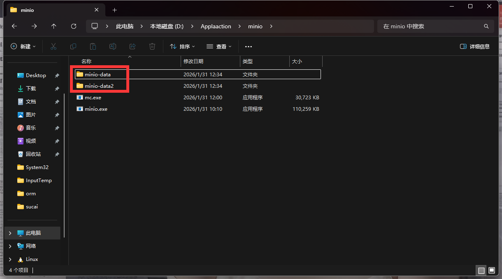

# 集成minio

MinIO 是一款开源、高性能的对象存储系统，兼容 Amazon S3 API，适用于各种规模的数据存储需求。

**适用场景**

- 图片存储
- 视频点播
- 日志归档
- 备份与灾备

## 安装 MinIO

打开网址：`https://minio.org.cn/download.shtml#/windows` 下载时不需要翻墙。


1. 下载server -> minio.exe
2. 下载client -> mc.exe

两个都要下载，下载完成之后放入文件夹即可,在文件夹里面新建两个文件名字可以随便取，我这儿叫`minio-data` `minio-data2`。进行集群存储，方便数据备份。




windows CMD命令行启动

新建一个文件`start.cmd`

```cmd
set MINIO_ROOT_USER=admin
set MINIO_ROOT_PASSWORD=12345678
minio.exe server .\minio-data .\minio-data2 --console-address ":9001"
```

Mac bash命令行启动

新建一个文件`start.sh`

```bash
export MINIO_ROOT_USER=admin
export MINIO_ROOT_PASSWORD=12345678
minio server ./minio-data ./minio-data2 --console-address ":9001"
```

执行成功后输出以下信息


```bash
Copyright: 2015-2026 MinIO, Inc.
License: GNU AGPLv3 - https://www.gnu.org/licenses/agpl-3.0.html
Version: RELEASE.2025-07-23T15-54-02Z (go1.24.5 windows/amd64)

API: http://192.168.2.100:9000  http://172.31.144.1:9000  http://26.26.26.1:9000  http://127.0.0.1:9000
   RootUser: admin
   RootPass: 12345678

WebUI: http://192.168.2.100:9001 http://172.31.144.1:9001 http://26.26.26.1:9001 http://127.0.0.1:9001
   RootUser: admin
   RootPass: 12345678

CLI: https://min.io/docs/minio/linux/reference/minio-mc.html#quickstart
   $ mc alias set 'myminio' 'http://192.168.2.100:9000' 'admin' '12345678'

```

- 9000 是API端口
- 9001 是WebUI端口

注意：
执行 `mc alias set 'myminio' 'http://192.168.2.100:9000' 'admin' '12345678'` 命令，不要用单引号或者使用双引号替换单引号


生成access秘钥

```bash
mc admin user svcacct add myminio admin
# 输出以下信息
Access Key: FIIY8RE5QUTXWGBBAE4S #替换成你的
Secret Key: bQWn6Cbxrz5+6yNApomCNsfAjMgSTDLJtEbyehcZ #替换成你的
Expiration: no-expiry
```
把上面秘钥放入.env文件中

```bash
# minio access秘钥
MINIO_ACCESS_KEY="FIIY8RE5QUTXWGBBAE4S"
# minio secret秘钥
MINIO_SECRET_KEY="bQWn6Cbxrz5+6yNApomCNsfAjMgSTDLJtEbyehcZ"
# minio 地址
MINIO_ENDPOINT="192.168.2.100"
# minio 端口
MINIO_PORT=9000
# minio 是否使用SSL
MINIO_USE_SSL=0
# minio 桶名
MINIO_BUCKET="avatar"
```

安装 sdk： 
- pnpm add minio
- pnpm add @types/multer -D

案例：

```ts
// minio.service.ts
import { Injectable, OnModuleInit } from '@nestjs/common';
import * as Minio from 'minio';
import { ConfigService } from '@nestjs/config';

@Injectable()
export class MinioService implements OnModuleInit {
  private readonly minioClient: Minio.Client;

  constructor(private readonly configService: ConfigService) {
    this.minioClient = new Minio.Client({
      endPoint: this.configService.get<string>('MINIO_ENDPOINT')!, // minio地址
      port: Number(this.configService.get('MINIO_PORT')), // minio端口
      useSSL: !!Number(this.configService.get<string>('MINIO_USE_SSL')), // 是否使用SSL
      accessKey: this.configService.get<string>('MINIO_ACCESS_KEY')!, // minio访问密钥
      secretKey: this.configService.get<string>('MINIO_SECRET_KEY')! // minio密钥
    });
  }

  async onModuleInit() {
    // 检查桶是否存在，不存在则创建
    const bucketName = this.configService.get<string>('MINIO_BUCKET')!;
    const exist = await this.minioClient.bucketExists(bucketName);
    if (!exist) {
      await this.minioClient.makeBucket(bucketName);
      await this.minioClient.setBucketPolicy(
        bucketName,
        JSON.stringify({
          Version: '2012-10-17', // 策略语言版本版本 类似于http版本 例如http1.1 http2.0 这个值固定即可
          Statement: [
            {
              Sid: 'PublicReadObjects', // 给这个规则起一个名字
              Effect: 'Allow', // 允许打开这个规则 Allow 允许 Deny 拒绝
              Principal: '*', // 所有人
              Action: ['s3:GetObject'], // 允许浏览器获取对象
              Resource: ['arn:aws:s3:::avatar/*'] // 允许读取 avatar桶内的所有资源
            }
          ]
        })
      );
    }
  }

  // 获取minio客户端
  getClient() {
    return this.minioClient;
  }
  // 获取minio桶名
  getBucket() {
    return this.configService.get<string>('MINIO_BUCKET')!;
  }
}
```

```ts
// user.service.ts
...
  // 上传头像
  async uploadAvatar(file: Express.Multer.File) {
    if (!file) {
      return this.responseService.error(null, '文件不存在');
    }

    if (file.size > 1024 * 1024 * 5) {
      return this.responseService.error(null, '文件大小不能超过5MB');
    }
    // 获取minio客户端
    const client = this.minioService.getClient();
    // 获取bucket桶名
    const bucket = this.minioService.getBucket();
    // 资源的名称
    const fileName = `${Date.now()}-${file.originalname}`;
    // 上传资源到minio
    await client.putObject(bucket, fileName, file.buffer, file.size, {
      'Content-Type': file.mimetype
    });
    // 返回文件url
    const isHttps = !!Number(this.configService.get('MINIO_USE_SSL')); // 是否启用SSL
    const baseUrl = isHttps ? 'https' : 'http'; // 前缀http
    const port = this.configService.get<string>('MINIO_PORT')!; // 端口9000
    const databaseUrl = `/${bucket}/${fileName}`; // 数据库url /avatar/1234567890-xxx.jpg
    const previewUrl = `${baseUrl}://${this.configService.get('MINIO_ENDPOINT')}:${port}${databaseUrl}`;
    // previewUrl-> http://192.168.2.100:9000/avatar/1234567890-xxx.jpg
    // databaseUrl-> /avatar/1234567890-xxx.jpg
    return this.responseService.success({
      previewUrl,
      databaseUrl
    });
  }
...
```